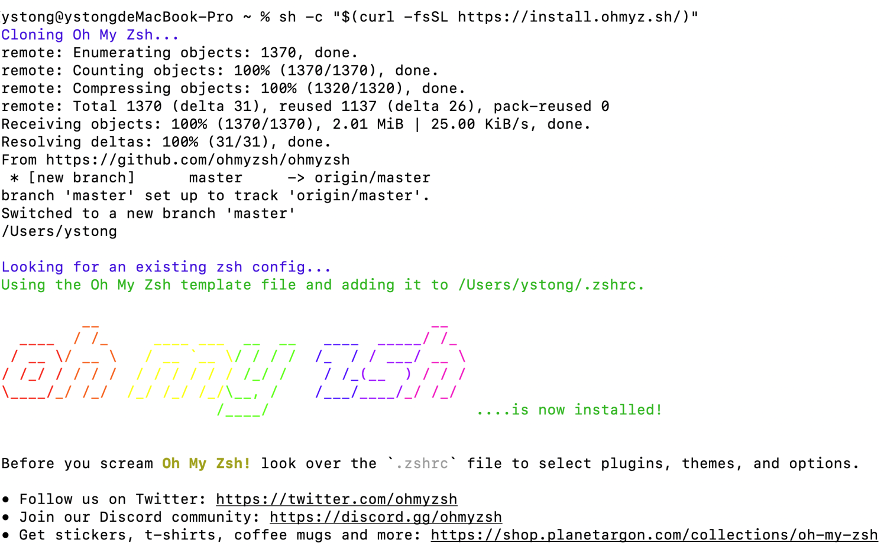
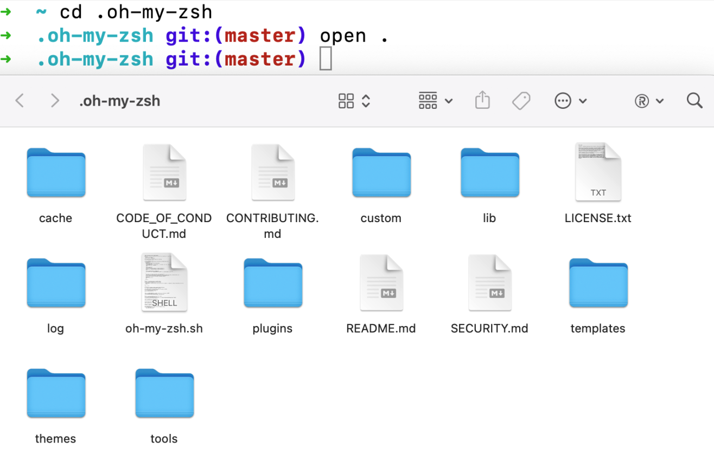
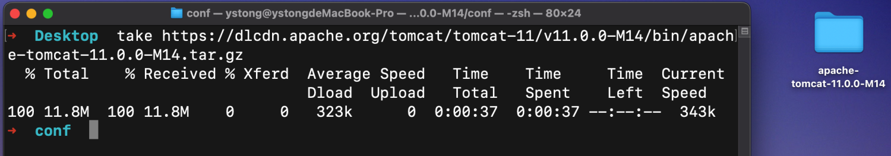

哈喽，各位小伙伴大家好，我是小佟！ohmyzsh作为程序员必备的终端工具，岂能不知不会，今天小佟就带你手把手安装并配置好ohmyzsh工具！

## 写在前面

官网：https://ohmyz.sh/

Github开源地址：https://github.com/ohmyzsh/ohmyzsh

## ohmyzsh是个什么东西

1. A delightful community-driven (with 2,200+ contributors) framework for managing your zsh configuration. Includes 300+ optional plugins (rails, git, macOS, hub, docker, homebrew, node, php, python, etc), 140+ themes to spice up your morning, and an auto-update tool so that makes it easy to keep up with the latest updates from the community.
2. 一个令人愉快的社区驱动（拥有2200多名贡献者）框架，用于管理您的zsh配置。包括300多个可选插件（rails、git、macOS、hub、docker、homebrew、node、php、python等），140多个主题，让你的早晨充满活力，还有一个自动更新工具，可以轻松跟上社区的最新更新。

## 安装前提条件是什么

1. 已安装zsh、curl或者wget、git，更多安装注意事项可以参考：https://github.com/ohmyzsh/ohmyzsh
2. Mac最新的Sonoma14系统默认使用的就是zsh，可以使用zsh --version命令或者echo $SHELL命令来验证

## 怎么安装

1. 原始安装（墙外）：`sh -c "$(curl -fsSL https://raw.githubusercontent.com/ohmyzsh/ohmyzsh/master/tools/install.sh)"`
2. 镜像安装（墙内）：`sh -c "$(curl -fsSL https://install.ohmyz.sh/)"`

## 安装过程及结果



出现如上图所示的安装结果表明安装成功！那么该安装结果给你的系统带来了哪些变化呢？

- 用户家目录下增加了两个内容，其中一个是.zshrc配置文件，该文件内容如下所示：

```shell
# If you come from bash you might have to change your $PATH.
# export PATH=$HOME/bin:/usr/local/bin:$PATH

# Path to your oh-my-zsh installation.
export ZSH="$HOME/.oh-my-zsh"

# Set name of the theme to load --- if set to "random", it will
# load a random theme each time oh-my-zsh is loaded, in which case,
# to know which specific one was loaded, run: echo $RANDOM_THEME
# See https://github.com/ohmyzsh/ohmyzsh/wiki/Themes
ZSH_THEME="robbyrussell"

# Set list of themes to pick from when loading at random
# Setting this variable when ZSH_THEME=random will cause zsh to load
# a theme from this variable instead of looking in $ZSH/themes/
# If set to an empty array, this variable will have no effect.
# ZSH_THEME_RANDOM_CANDIDATES=( "robbyrussell" "agnoster" )

# Uncomment the following line to use case-sensitive completion.
# CASE_SENSITIVE="true"

# Uncomment the following line to use hyphen-insensitive completion.
# Case-sensitive completion must be off. _ and - will be interchangeable.
# HYPHEN_INSENSITIVE="true"

# Uncomment one of the following lines to change the auto-update behavior
# zstyle ':omz:update' mode disabled  # disable automatic updates
# zstyle ':omz:update' mode auto      # update automatically without asking
# zstyle ':omz:update' mode reminder  # just remind me to update when it's time

# Uncomment the following line to change how often to auto-update (in days).
# zstyle ':omz:update' frequency 13

# Uncomment the following line if pasting URLs and other text is messed up.
# DISABLE_MAGIC_FUNCTIONS="true"

# Uncomment the following line to disable colors in ls.
# DISABLE_LS_COLORS="true"

# Uncomment the following line to disable auto-setting terminal title.
# DISABLE_AUTO_TITLE="true"

# Uncomment the following line to enable command auto-correction.
# ENABLE_CORRECTION="true"

# Uncomment the following line to display red dots whilst waiting for completion.
# You can also set it to another string to have that shown instead of the default red dots.
# e.g. COMPLETION_WAITING_DOTS="%F{yellow}waiting...%f"
# Caution: this setting can cause issues with multiline prompts in zsh < 5.7.1 (see #5765)
# COMPLETION_WAITING_DOTS="true"

# Uncomment the following line if you want to disable marking untracked files
# under VCS as dirty. This makes repository status check for large repositories
# much, much faster.
# DISABLE_UNTRACKED_FILES_DIRTY="true"

# Uncomment the following line if you want to change the command execution time
# stamp shown in the history command output.
# You can set one of the optional three formats:
# "mm/dd/yyyy"|"dd.mm.yyyy"|"yyyy-mm-dd"
# or set a custom format using the strftime function format specifications,
# see 'man strftime' for details.
# HIST_STAMPS="mm/dd/yyyy"

# Would you like to use another custom folder than $ZSH/custom?
# ZSH_CUSTOM=/path/to/new-custom-folder

# Which plugins would you like to load?
# Standard plugins can be found in $ZSH/plugins/
# Custom plugins may be added to $ZSH_CUSTOM/plugins/
# Example format: plugins=(rails git textmate ruby lighthouse)
# Add wisely, as too many plugins slow down shell startup.
plugins=(git)

source $ZSH/oh-my-zsh.sh

# User configuration

# export MANPATH="/usr/local/man:$MANPATH"

# You may need to manually set your language environment
# export LANG=en_US.UTF-8

# Preferred editor for local and remote sessions
# if [[ -n $SSH_CONNECTION ]]; then
#   export EDITOR='vim'
# else
#   export EDITOR='mvim'
# fi

# Compilation flags
# export ARCHFLAGS="-arch x86_64"

# Set personal aliases, overriding those provided by oh-my-zsh libs,
# plugins, and themes. Aliases can be placed here, though oh-my-zsh
# users are encouraged to define aliases within the ZSH_CUSTOM folder.
# For a full list of active aliases, run `alias`.
#
# Example aliases
# alias zshconfig="mate ~/.zshrc"
# alias ohmyzsh="mate ~/.oh-my-zsh"
```

* 另一个变化就是增加了隐藏目录.oh-my-zsh，目录具体内容如下图所示：



## 如何使用插件（plugin）

1. /Users/ystong/.oh-my-zsh/plugins目录里面已经内置了很多的插件，关于每个插件的功能展示可以参考官方文档。如果想要使用某个插件，只需要在.zshrc文件中的plugins下设置该插件的名字即可！！

2. 推荐几个有用的插件
   1. git：定义了很多git相关命令的别名和功能函数脚本
   2. aliases：更好用的管理命令别名的工具，例如可以分组显示别名信息
   3. tmux：定义了很多tmux相关命令的别名
   4. z：目录之间的快速跳转
   5. zsh-syntax-highlighting：命令行语法高亮（属于第三方插件，需要自己安装）
   6. zsh-autosuggestions：自动补全（属于第三方插件，需要自己安装）
   7. web-search：web搜索命令（属于第三方插件，需要自己安装）

3. 更多内容参考官方文档：https://github.com/ohmyzsh/ohmyzsh/wiki/Plugins
   1. [第三方插件](https://github.com/ohmyzsh/ohmyzsh/wiki/External-plugins)如何使用（举个[第三方插件的例子](https://github.com/zsh-users/)）？
      1. 将插件安装在/Users/ystong/.oh-my-zsh/custom/plugins目录下
      2. 在.zshrc文件中的plugins下设置该插件的名字

## 如何使用主题（theme）

1. /Users/ystong/.oh-my-zsh/themes目录里面已经内置了很多的主题，关于每个主题的效果展示可以参考[官方文档](https://github.com/ohmyzsh/ohmyzsh/wiki/Themes)。如果想要使用某个主题，只需要在.zshrc文件中的ZSH_THEME下设置该主题的名字即可！！
2. 修改完该文件，如果想要在当前Shell窗口生效，则记得使用source命令重新激活一下！！！要不然就新开启一个Shell的标签或者窗口，要不然就关闭并重新打开Shell窗口！！！（后面会推荐使用另一个命令）
3. 官方使用说明：`In order to enable a theme, set ZSH_THEME to the name of the theme in your ~/.zshrc, before sourcing Oh My Zsh; for example: ZSH_THEME=robbyrussell If you do not want any theme enabled, just set ZSH_THEME to blank: ZSH_THEME=""`（不想使用任何主题就设置ZSH_THEME=""即可）
4. 更多内容参考官方文档：https://github.com/ohmyzsh/ohmyzsh/wiki/Themes
   1. [第三方主题](https://github.com/ohmyzsh/ohmyzsh/wiki/External-themes)如何使用（举个[第三方主题的例子](https://github.com/fjpalacios/elessar-theme)）？
      1. 将主题安装在/Users/ystong/.oh-my-zsh/custom/themes目录下
      2. 在.zshrc文件中的ZSH_THEME下设置该主题的名字

## 如何更新、卸载、修改完配置文件如何加载

1. 查看更多omz命令
   1. omz --help：可以查看更多的omz命令，通过这些命令也可以管理插件、主题等（通过上述的CLI命令管理则不需要重新加载.zshrc文件）
2. 更新
   1. omz update
3. 卸载
   1. uninstall_oh_my_zsh
4. 修改完配置文件重新加载（推荐推荐推荐）
   1. omz reload：请避免使用source命令，原因请参考官方文档
   2. https://github.com/ohmyzsh/ohmyzsh/wiki/FAQ#how-do-i-reload-the-zshrc-file

## 安装ohmyzsh之后还有哪些更强大的地方呢

1. alias：列出系统所有的命令别名（alias是Shell内置命令，在没有配置其他别名的前提下就是ohmyzsh内置的所有别名，换句话说就是ohmyzsh帮我们设置好了一些别名）
   1. 如果想自己定义其他的命令别名，可以在zshrc文件中进行定义
2. mkcd：创建目录并进入（由ohmyzsh创建了该命令）
3. zsh_stats：列出前20个使用频率最高的命令（由ohmyzsh创建了该命令）
4. take：功能类似于mkcd命令（可以完全替代mkcd命令），不过该命令可以识别远程URL信息（`something that ends in .git or .tar.(gz|bz2|xz)`），当给定的参数看起来像是一个URL的时候，该命令会下载当前资源并提取到当前目录中，然后还会自动切入到提取目录或者下载目录或者克隆目录（由ohmyzsh创建了该命令）使用举例如下图所示：



通过上图可以看出会自动下载tomcat文件并解压提取，最后还自动切换到了conf目录中。

```shell
# 该使用方式并不太常用，使用时将其认为和mkcd一样功能即可
take https://dlcdn.apache.org/tomcat/tomcat-11/v11.0.0-M14/bin/apache-tomcat-11.0.0-M14.tar.gz
```

## 我的配置文件

```shell
# If you come from bash you might have to change your $PATH.
# export PATH=$HOME/bin:/usr/local/bin:$PATH

# Path to your oh-my-zsh installation.
export ZSH="$HOME/.oh-my-zsh"

# Set name of the theme to load --- if set to "random", it will
# load a random theme each time oh-my-zsh is loaded, in which case,
# to know which specific one was loaded, run: echo $RANDOM_THEME
# See https://github.com/ohmyzsh/ohmyzsh/wiki/Themes
ZSH_THEME="elessar" # set by `omz`

# Set list of themes to pick from when loading at random
# Setting this variable when ZSH_THEME=random will cause zsh to load
# a theme from this variable instead of looking in $ZSH/themes/
# If set to an empty array, this variable will have no effect.
# ZSH_THEME_RANDOM_CANDIDATES=( "robbyrussell" "agnoster" )

# Uncomment the following line to use case-sensitive completion.
# CASE_SENSITIVE="true"

# Uncomment the following line to use hyphen-insensitive completion.
# Case-sensitive completion must be off. _ and - will be interchangeable.
# HYPHEN_INSENSITIVE="true"

# Uncomment one of the following lines to change the auto-update behavior
# zstyle ':omz:update' mode disabled  # disable automatic updates
# zstyle ':omz:update' mode auto      # update automatically without asking
# zstyle ':omz:update' mode reminder  # just remind me to update when it's time

# Uncomment the following line to change how often to auto-update (in days).
# zstyle ':omz:update' frequency 13

# Uncomment the following line if pasting URLs and other text is messed up.
# DISABLE_MAGIC_FUNCTIONS="true"

# Uncomment the following line to disable colors in ls.
# DISABLE_LS_COLORS="true"

# Uncomment the following line to disable auto-setting terminal title.
# DISABLE_AUTO_TITLE="true"

# Uncomment the following line to enable command auto-correction.
# ENABLE_CORRECTION="true"

# Uncomment the following line to display red dots whilst waiting for completion.
# You can also set it to another string to have that shown instead of the default red dots.
# e.g. COMPLETION_WAITING_DOTS="%F{yellow}waiting...%f"
# Caution: this setting can cause issues with multiline prompts in zsh < 5.7.1 (see #5765)
# COMPLETION_WAITING_DOTS="true"

# Uncomment the following line if you want to disable marking untracked files
# under VCS as dirty. This makes repository status check for large repositories
# much, much faster.
# DISABLE_UNTRACKED_FILES_DIRTY="true"

# Uncomment the following line if you want to change the command execution time
# stamp shown in the history command output.
# You can set one of the optional three formats:
# "mm/dd/yyyy"|"dd.mm.yyyy"|"yyyy-mm-dd"
# or set a custom format using the strftime function format specifications,
# see 'man strftime' for details.
# HIST_STAMPS="mm/dd/yyyy"

# Would you like to use another custom folder than $ZSH/custom?
# ZSH_CUSTOM=/path/to/new-custom-folder

# Which plugins would you like to load?
# Standard plugins can be found in $ZSH/plugins/
# Custom plugins may be added to $ZSH_CUSTOM/plugins/
# Example format: plugins=(rails git textmate ruby lighthouse)
# Add wisely, as too many plugins slow down shell startup.
plugins=(git aliases tmux z zsh-syntax-highlighting web-search zsh-autosuggestions)

source $ZSH/oh-my-zsh.sh

# User configuration

# export MANPATH="/usr/local/man:$MANPATH"

# You may need to manually set your language environment
# export LANG=en_US.UTF-8

# Preferred editor for local and remote sessions
# if [[ -n $SSH_CONNECTION ]]; then
#   export EDITOR='vim'
# else
#   export EDITOR='mvim'
# fi

# Compilation flags
# export ARCHFLAGS="-arch x86_64"

# Set personal aliases, overriding those provided by oh-my-zsh libs,
# plugins, and themes. Aliases can be placed here, though oh-my-zsh
# users are encouraged to define aliases within the ZSH_CUSTOM folder.
# For a full list of active aliases, run `alias`.
#
# Example aliases


# 在Terminal中指定用Sublime打开文件或者目录
alias sublime='open -a /Applications/Sublime\ Text.app'
# 在Terminal中指定用Sublime打开ohmyzsh安装目录
alias ohmyzsh="sublime ~/.oh-my-zsh"
# 在Terminal中指定用Sublime打开zshrc配置文件
alias zshconfig="sublime ~/.zshrc"
# 清空Terminal显示的内容
alias c="clear"
# 修改zprofile文件重新加载生效
alias szprofile="source ~/.zprofile"
# 修改zshrc文件重新加载生效
alias szshrc="source ~/.zshrc"
# 删除文件到废纸篓
alias delete="trash -F"
# git工具修改为英文显示
alias git='LANG=en_GB git'
```