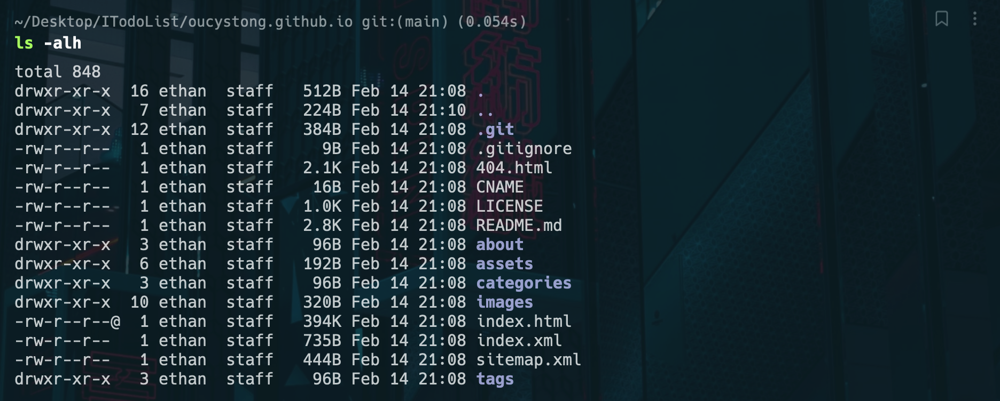
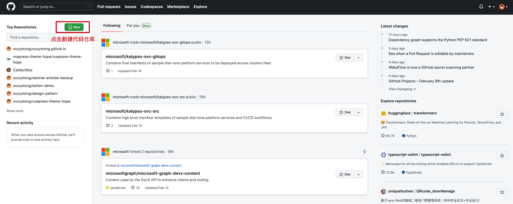
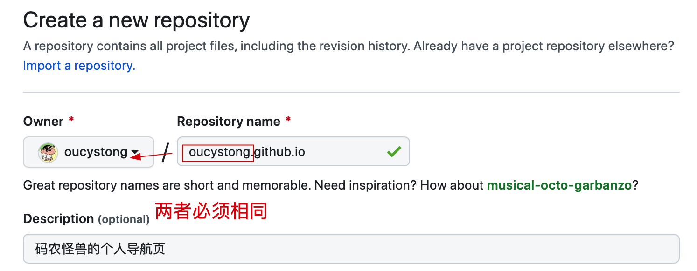
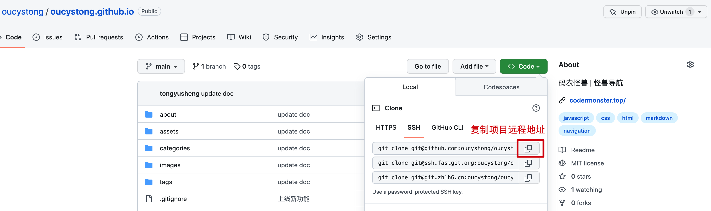
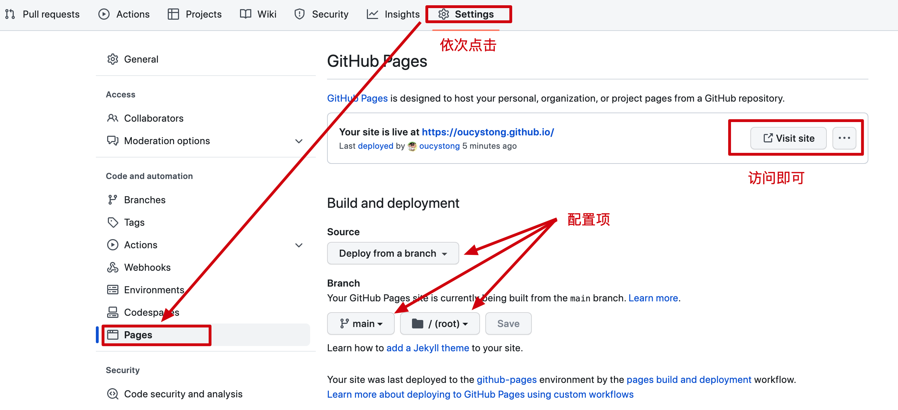
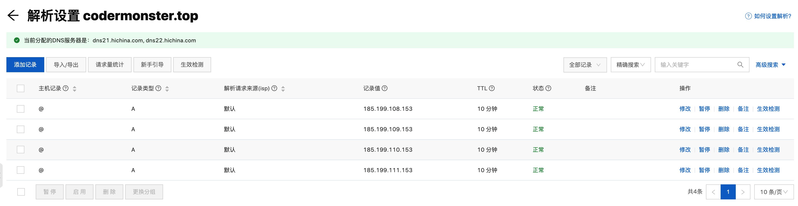
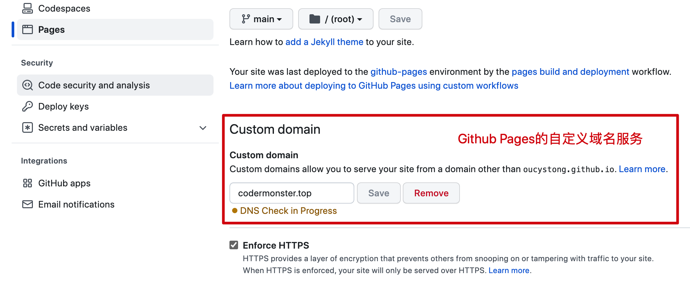

大家好，我是怪兽。

相信大家在日常的工作学习生活中，经常会用到导航网站。如果你用过[360导航](https://hao.360.com/)或者是[网址之家导航](https://www.hao123.sh/)，那你肯定知道在不安装屏蔽广告的浏览器插件的情况下，那广告简直是锣鼓喧天，鞭炮齐鸣，红旗招展，人山人海。还有就是这些导航网站为了照顾大多数网民的需求（我绝对不说是竞价排名），会增加很多实际生活中你用不到的导航，今天怪兽就教给大家零成本打造属于一个自己的实用且干净的导航网站。

## 效果演示

废话少说，先上图一览为敬。

* 日间模式


* 夜间模式


上面的怪兽导航是怪兽本人搭建的，可以看到这个导航网站有以下几个优点：

1、可以自定义所有的导航地址

2、支持日间和夜间模式切换

3、支持网页全屏功能

4、好看、干净、无广告且实用

5、支持站点公告功能

6、支持其他人提交实用站点的功能

7、不需要单独购买服务器，纯静态导航网站借助于Github Pages实现零成本部署

说了这么多，那我们接下来开始搭建属于自己的干净且实用的导航网站吧！

>怪兽导航地址：https://codermonster.top/

## 克隆项目

>前提技能：
>
>1、本地计算机需要安装Git工具，并且会简单使用Git，需要学习请参考：https://gitee.com/all-about-git
>
>2、会CV（复制粘贴）大法，会简单修改HTML页面，需要学习HTML请参考：https://www.runoob.com/html/html-tutorial.html

怪兽导航的源码托管在Github上，所以在你会用Git之后，只需要克隆该项目到本地就可以，在终端执行依次执行如下命令：

```shell
# 克隆项目到本地
git clone git@github.com:oucystong/oucystong.github.io.git
# 切换到项目目录中
cd oucystong.github.io/
# 查看所有的项目的所有文件
ls -alh
```

至此，我们可以看到项目的所有源码和静态资源如下所示：



在项目的所有源码和静态资源下载到本地之后，下面我们先把项目部署到Github Pages上，让大家在公网都可以访问你的导航地址。

## 部署项目

首先需要做的就是先在[Github官网](https://github.com/)上注册一个账号，在完成注册之后，需要先创建一个仓库，具体操作如下图所示：



在创建仓库的时候有几个配置项需要填写，具体要求见下图：



其他配置项默认即可，然后点击新建仓库就可以了。

下面我们回到本地项目中，看一下项目绑定的远程地址，执行命令如下：

```shell
# 执行命令
git remote -v
# 执行结果
origin	git@github.com:oucystong/oucystong.github.io.git (fetch)
origin	git@github.com:oucystong/oucystong.github.io.git (push)
```

可以看到项目绑定的远程地址是怪兽的，不是你刚刚创建的仓库的远程地址，现在我们需要把这个地址设置成你刚刚创建仓库的地址，回到你的仓库中，然后按照下图复制远程地址：



执行如下命令，设置本地项目的远程地址：

```shell
# 设置远程仓库地址
git remote set-url origin <你的仓库地址>
# 查看远程仓库地址
git remote -v
```

接下来我们需要把所有的代码提交到远程仓库，执行命令如下：

```shell
# 提交代码丝滑三连招
git add .
git commit -m "update"
git push -u origin main
```

最后一步就是我们需要在Github上打开Github Pages页面，配置相关属性就可以实现公网访问了，具体操作如下图所示：



在部署完成之后，我们直接访问就可以了，以我的仓库为例，其访问地址为：

`https://oucystong.github.io`

你的访问地址与此类似，只不过地址后面跟着的是你项目仓库的名称，需要注意的是里面的导航地址的图标全都是图片资源，而且数量也不少，所以一开始加载速度可能稍慢一些，等你通过浏览器多访问几次，等待本地有缓存之后，其速度就会快很多了。

## 绑定域名

如果你觉得Github Pages的域名不好记忆，或者是你拥有自己的域名，然后想绑定到Github Pages上，然后通过访问自定义域名实现访问导航网站，其实也是可以实现的，接下来我们开始操作。

首先你需要在[阿里云](https://www.aliyun.com/)或者[腾讯云](https://cloud.tencent.com/)买一个域名，这个当然是根据自己的喜好购买即可，而且也不需要太昂贵，比如怪兽本人的`https://codermonster.top/`一年的费用才有九块钱。

其次我们需要在本地项目路径下修改CNAME文本文件，文件内容：

```shell
# 文件内容是你申请的域名地址 | 需要注意：本条注释不需要写
codermonster.top
```

然后我们需要在阿里云或者腾讯云上配置域名的DNS解析服务，使其可以通过该域名解析道Github Pages的IP地址，进而实现对导航的访问，Github Pages的IP地址如下所示：

```shell
# Github Pages的IP地址
185.199.108.153
185.199.109.153
185.199.110.153
185.199.111.153
```

以阿里云的域名DNS服务配置为例，其配置项如下图所示：



最后我们需要在Github Pages的设置界面配置一下你申请的域名：



完成上述所有步骤之后，等待10分钟左右，我们就可以通过自定义的域名实现个人导航网站的访问了。

## 本文总结

1、干净又实用的导航网站基于怪兽导航源码实现，其源码托管在Github上，克隆并修改源码即可实现自定义导航。

2、通过Github Pages实现免服务器零成本部署项目。

3、通过阿里云或者腾讯云申请个性化域名实现于Github Pages域名的绑定，最终可以达到访问自定义域名即可访问导航网站的效果。

>自定义修改导航内的站点：
>
>1、只需要修改index.html文件和提供站点图标到assets/images/logos/。
>
>2、修改完毕后将代码推送到远程仓库，Github Pages会自动进行更新部署。