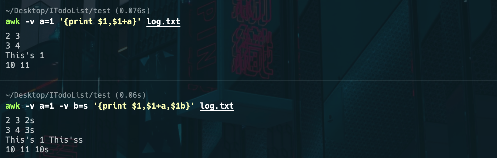

大家好，我是怪兽。

作为一名合格的程序员，在实际开发中，我们不免会连接服务器终端执行一些运维操作，在服务器上那必然是没有图形界面的，所以对于一些文本文件的处理显得尤为麻烦，但是强大的终端命令提供了比图形界面更强大的功能，今天怪兽教给大家快速掌握Linux中的文本处理三剑客。

## 总体把握

Linux中的文本处理三剑客分别是`grep、awk、sed`，它们都以正则表达式作为基础，而在Linux系统中，支持两种正则表达式，分别为“标准正则表达式”和“扩展正则表达式”，正则表达式的内容我们后续会讲，首先我们先明确一下三剑客的特点及应用场景，如下表所示：

| 命令 | 特点     | 应用场景                                                 |
| ---- | -------- | -------------------------------------------------------- |
| grep | 文本过滤 | 包括从文件中进行过滤和从标准输入进行过滤，其过滤速度最快 |
| sed  | 取行     | 文件内容新增、删除、替换、取出某个范围的内容             |
| awk  | 取列     | 编写awk脚本对文本进行格式化输出（可进行统计计算）        |

## grep命令

grep命令家族由`grep、egrep、fgrep` 三个子命令组成，适用于不同的场景。

* grep：原生的grep命令，使用“标准正则表达式”作为匹配标准。
* egrep：扩展的grep命令，相当于grep -E，使用“扩展正则表达式”作为匹配标准。
* fgrep：简化版的grep命令，相当于grep -F，不支持正则表达式，只支持固定的字符串，但搜索速度快，系统资源使用率低。

我们先来看一下grep命令的常用方法，新建一个`testGrep`文件，文件内容如下所示：

```shell
CoderMonster Test Grep1
Oucystong Test Grep2
Xiaotong Test Grep3
Coder Test Grep4
Programmer Test Grep5
```

1、找到包含Grep字符串的所有内容行

```shell
# 查找包含特定字符串的内容
grep "Grep" testGrep
```

执行结果：


通过上面的结果可以看到，并不是精确查找只包含Grep字符串的内容，而是模糊匹配，只要是包含Grep字符串，其内容都会被检索到。

2、精确查找Grep4字符串所在的内容行

```shell
# -F参数表明精确匹配，不支持正则表达式
grep -F Grep4 testGrep
# 或者使用以下命令
grep --fixed-strings  "Grep4" testGrep
```

执行结果：


3、忽略大小写查找test字符串所在的内容行

```shell
# grep命令默认是严格大小写的
grep "test" testGrep
```

执行上面的命令并不能查到任何结果，这是因为grep命令默认是严格大小写的，所以如果想要查找到test字符串所在的内容行，必须通过参数设定来忽略大小写。

```shell
# 忽略大小写
grep --ignore-case "test" testGrep
```

执行结果：


4、从标准输入来过滤忽略大小写查找test字符串所在的内容行

```shell
# 从标准输入进行过滤
cat testGrep | grep --ignore-case "test"
```

执行结果：


>注意：
>
>1、grep命令如果不添加`-F参数`，那么默认就是支持正则表达式匹配，其效果与egrep命令相同。
>
>2、grep命令如果添加`-F参数`，那么就是只支持固定字符串匹配，其效果与fgrep命令相同。

### 小结

grep命令总结：

```shell
- 【重要】Search for a pattern within a file:
    grep "search_pattern" path/to/file

- 【重要】Search for an exact string (disables regular expressions):
    grep --fixed-strings "exact_string" path/to/file

- Search for a pattern in all files recursively in a directory, showing line numbers of matches, ignoring binary files:
    grep --recursive --line-number --binary-files=without-match "search_pattern" path/to/directory

- 【重要】Use extended regular expressions (supports `?`, `+`, `{}`, `()` and `|`), in case-insensitive mode:
    grep --extended-regexp --ignore-case "search_pattern" path/to/file

- 【重要】Print 3 lines of context around, before, or after each match:
    grep --context|before-context|after-context=3 "search_pattern" path/to/file

- 【重要】Print file name and line number for each match with color output:
    grep --with-filename --line-number --color=always "search_pattern" path/to/file

- 【重要】Search for lines matching a pattern, printing only the matched text:
    grep --only-matching "search_pattern" path/to/file

- 【重要】Search stdin for lines that do not match a pattern:
    cat path/to/file | grep --invert-match "search_pattern"
```

egrep命令总结：

```shell
- 【重要】Search for a pattern within a file:
    egrep "search_pattern" path/to/file

- 【重要】Search for a pattern within multiple files:
    egrep "search_pattern" path/to/file1 path/to/file2 path/to/file3

- 【重要】Search stdin for a pattern:
    cat path/to/file | egrep search_pattern

- 【重要】Print file name and line number for each match:
    egrep --with-filename --line-number "search_pattern" path/to/file

- Search for a pattern in all files recursively in a directory, ignoring binary files:
    egrep --recursive --binary-files=without-match "search_pattern" path/to/directory

- 【重要】Search for lines that do not match a pattern:
    egrep --invert-match "search_pattern" path/to/file
```

fgrep命令总结：

```shell
- 【重要】Search for an exact string in a file:
    fgrep search_string path/to/file

- Search only lines that match entirely in files:
    fgrep -x path/to/file1 path/to/file2

- 【重要】Count the number of lines that match the given string in a file:
    fgrep -c search_string path/to/file

- Show the line number in the file along with the line matched:
    fgrep -n search_string path/to/file

- Display all lines except those that contain the search string:
    fgrep -v search_string path/to/file

- 【重要】Display filenames whose content matches the search string at least once:
    fgrep -l search_string path/to/file1 path/to/file2
```

## sed命令

sed全称为Stream EDitor，sed是一个流编辑器，在处理行内容时功能十分强大，可以利用脚本来处理文本文件或者是标准输入`（stdin）`。

使用语法：

```shell
sed [-hnV][-e<script>][-f<script文件>][文本文件]
```

我们接下来看一下sed命令的用法，首先新创建一个`sedtest.txt`的文本文件，文件内容如下：

```shell
HELLO LINUX!  
Linux is a free unix-type opterating system.  
This is a linux testfile!  
Linux test 
Google
Taobao
Runoob
Tesetfile
Wiki
```

sed命令中有三个概念：参数、脚本、动作，其中动作用于编写脚本，废话少说，我们通过案例来实际操作一下：

```shell
# 创建一个文件
touch sedtest.txt
# 将上述文件内容拷贝进去
# 查看文件内容方式1-纯粹打印
cat sedtest.txt
# 查看文件内容方式2-带行号显示
nl sedtest.txt

# 向文件新增一行内容-【不会改变原文件内容】
sed -e '4anewLine' ./sedtest.txt

# 以行为单位进行新增/删除，在知道行号的情况下使用-【不会改变文件内容】
# 第 2~5 行删除，两个边界都包括
nl ./sedtest.txt | sed -e '2,5d'
# 只删除第2行
nl ./sedtest.txt | sed -e '2d'
# 删除3到最后一行，两个边界都包括
nl ./sedtest.txt | sed -e '3,$d'
# 第二行后加上drink tea
nl ./sedtest.txt | sed -e '2adrink tea'
# 第二行前加上drink tea
nl ./sedtest.txt | sed -e '2idrink tea'
# 增加两行以上，在第二行后面加入两行字
nl ./sedtest.txt | sed -e '2adrink tea\
drink beer'# 每一行之间都必须要以反斜杠 \ 来进行新行标记。

# 以行为单位的替换和显示-【不会改变文件内容】
# 将第 2-5 行的内容取代成为 No 2-5 number
nl ./sedtest.txt | sed -e '2,5cNo 2-5 number'
# 列出文件内的第 5-7 行
nl ./sedtest.txt | sed -n '5,7p'

# 数据的搜寻并显示，在不知道行号的情况下使用-【不会改变文件内容】
# 搜索文件中有 oo 关键字的行
nl ./sedtest.txt | sed -n '/oo/p'

# 数据的搜寻并删除，在不知道行号的情况下使用-【不会改变文件内容】
# 删除文件中所有包含 oo 的行
nl ./sedtest.txt | sed -e '/oo/d'

# 数据的搜寻并新增，在不知道行号的情况下使用-【不会改变文件内容】
# 找到文件中所有包含 oo 的行，并在其后面一行新增加内容xiaotong
nl ./sedtest.txt | sed -e '/oo/axiaotong'# 向后新增
nl ./sedtest.txt | sed -e '/oo/ixiaotong'# 向前新增

# 数据的搜寻并执行命令，在不知道行号的情况下使用-【不会改变文件内容】
# 搜索文件，找到 oo 对应的行，执行后面花括号中的一组命令，每个命令之间用分号分隔，这里把 oo 替换为 kk
nl ./sedtest.txt | sed -n '/oo/{s/oo/kk/;p;q}'  # 最后的 q 是退出

# 数据的查找与替换-【不会改变文件内容】
# 除了整行的处理模式之外， sed 还可以行为单位进行部分数据的查找与替换
# 将文件中每行第一次出现的 oo 用字符串 kk 替换
nl ./sedtest.txt | sed -e 's/oo/kk/'
# g 标识符表示全局查找替换，使 sed 对文件中所有符合的字符串都被替换
nl ./sedtest.txt | sed -e 's/oo/kk/g'
# 选项 i 使 sed 修改文件-【会修改文件内容】
sed -i 's/oo/kk/g' ./sedtest.txt

# 多点编辑-【不会改变文件内容】
# 一条 sed 命令，删除文件第三行到末尾的数据，并把 HELLO 替换为 TONG
nl ./sedtest.txt | sed -e '3,$d' -e 's/HELLO/TONG/g'

# 直接在一个文件的末尾添加一行新的数据-【会修改文件内容，在大文件下非常有效】
sed -i '$aThis is a test' ./sedtest.txt
# 对于大文件特别有效，这是因为其他的文本处理程序直接将文件读入内存，内存如果不是很大，处理起来就会很慢，但是sed是按照行将文件读入内存，速度快
```

通过上面的案例操作，我们可以简单总结一下：

1、参数介绍

* `-e<script>或--expression=<script>` 以选项中指定的`script`来处理输入的文本文件。
* `-f<script文件>或--file=<script文件>` 以选项中指定的`script`文件来处理输入的文本文件。
* `-n或--quiet或--silent` 仅显示`script`处理后的结果，包含`-e`。
* `-i`代表修改文件内容，包含`-e`。

2、动作介绍

* `a`：新增，`a` 的后面可以接字串，而这些字串会在新的一行出现（目前的下一行）
* `c`：取代，`c` 的后面可以接字串，这些字串可以取代 `n1,n2` 之间的行（取代选择的行）
* `d`：删除，因为是删除，所以 `d` 后面通常不接任何东西
* `i`：新增，`i` 的后面可以接字串，而这些字串会在新的一行出现（目前的上一行）
* `p`：打印，将某个选择的数据印出，通常 `p` 会与参数 `sed -n` 一起运行
* `s`：取代，可以直接进行取代的工作，通常这个 `s` 的动作可以搭配正则表达式（对每行中查找到的数据进行替换，粒度更细）

### 小结

sed命令总结：

```shell
- 【重要】Replace the first occurrence of a string in a file, and print the result:
    sed 's/find/replace/' filename

- 【重要】Replace all occurrences of an extended regular expression in a file:
    sed -E 's/regular_expression/replace/g' filename

- 【重要】Replace all occurrences of a string [i]n a file, overwriting the file (i.e. in-place):
    sed -i '' 's/find/replace/g' filename

- 【重要】Replace only on lines matching the line pattern:
    sed '/line_pattern/s/find/replace/' filename

- 【重要】Print only text between n-th line till the next empty line:
    sed -n 'line_number,/^$/p' filename

- 【重要】Apply multiple find-replace expressions to a file:
    sed -e 's/find/replace/' -e 's/find/replace/' filename

- 【重要】Replace separator `/` by any other character not used in the find or replace patterns, e.g. `#`:
    sed 's#find#replace#' filename

- 【重要】[d]elete the line at the specific line number [i]n a file, overwriting the file:
    sed -i '' 'line_numberd' filename
```

>注意：
>
>1、Mac系统与Linux系统下sed命令存在一些差异，详情可以参考：https://www.cnblogs.com/exmyth/p/14582067.html
>
>2、通常会下达 `sed -e` 命令，虽然没有 `-e` 也是可以的
>
>3、动作请务必以 `'...'` 两个单引号括住
>
>4、只要用到了动作p，参数就使用n，只要涉及到修改文件，就用参数i，其他情况全部使用参数e

## awk命令

awk是发明该工具三个作者姓名的首字母简称，awk是一个报表生成器，主要用于格式化输出，三个作者分别是：

* `Alfred Aho`
* `Peter Weinberger` 
* `Brian Kernighan`

awk按照行来读取文档，根据输入分隔符切分成小部分，用内建变量来表示，例如`$1`，`$2`，`$3`等，`$0`表示整行。

常用参数

* `-F`：指定分割符
* `-v`：定义变量
* `-f`：指定awk脚本文件

我们接下来再通过案例看一下awk命令的用法，首先新建一个`log.txt`文本文件，文件内容如下：

```shell
2 this is a test
3 Do you like awk
This's a test
10 There are orange,apple,mongo
```

1、格式化输出内容

```shell
# 每行按空格或TAB分割，输出文本中的1、4列
awk '{print $1,$4}' log.txt
# 格式化输出
awk '{printf "%-8s %-10s\n",$1,$4}' log.txt
```

执行结果：


2、指定分隔符格式化输出内容

```shell
# 使用","分割
awk -F , '{print $1,$2}' log.txt
# 或者使用内建变量
awk 'BEGIN{FS=","} {print $1,$2}' log.txt
# 使用多个分隔符。先使用空格分割，然后对分割结果再使用","分割
awk -F '[ ,]' '{print $1,$2,$5}' log.txt
```


3、设置变量并在脚本内使用

```shell
# 设置变量a
awk -v a=1 '{print $1,$1+a}' log.txt
# 设置变量a和变量b
awk -v a=1 -v b=s '{print $1,$1+a,$1b}' log.txt
```



4、通过指定脚本来处理文本文件

```shell
# 通过-f参数来指定脚本文件
awk -f cal.txt log.txt
```

awk工具的三位创建者已将awk脚本语言正式定义为“样式扫描和处理语言”，详细学习可以参考：https://awk.readthedocs.io/en/latest/index.html

接下来我们通过编写awk脚本来实现统计学生成绩数据，首先新建一个`student.txt`文本文件，文件内容如下：

```shell
cc 90 98 98 96 96 92
ll 70 77 85 83 70 89
ss 85 92 78 94 88 91
nn 89 90 85 94 90 95
bb 84 88 80 92 84 82
gg 64 80 60 60 61 62
```

编写`script.txt`脚本如下：

```c
# BEGIN模块
BEGIN {
    printf "姓名\t总分\t平均分\n"
}
# 代码块1-依次执行
{
    sum=0
    # NF表示每一行的字段数量
    for(i=2;i<=NF;i++)
        sum+=$i
}
# 代码块2-依次执行
{
    avg=sum/(NF-1)
    printf("%s\t%s\t%s\n", $1,sum,avg)
}
# END模块
END {
    printf "统计工作完成啦！\n"
}
```

执行命令：

```shell
awk -f script.txt student.txt
```

执行结果：


在脚本中的每一个主处理块之前，还可以通过模式匹配来决定当前文本行是否能够进入当前处理块，例如对于上面的案例，我们只想统计`ss`这位同学的总分和平均分，那我们需要对脚本的主处理块做如下的修改：

```c
# 代码块1-依次执行
/ss/ {# 模式匹配行ss
    sum=0
    # NF表示每一行的字段数量
    for(i=2;i<=NF;i++)
        sum+=$i
}
# 代码块2-依次执行
/ss/ {# 模式匹配行ss
    avg=sum/(NF-1)
    printf("%s\t%s\t%s\n", $1,sum,avg)
}
```

重新执行一下上面的命令，得到如下的执行结果：


通过上图可以看到，最后的统计结果只统计了`ss`这位同学的总分和平均分，这正是因为我们在统计计算之前使其只能够匹配到`ss`这位同学才达到的效果，最后我们通过一张图来解释一下awk命令的工作原理：


1、首先会执行脚本中BEGIN块的内容，这部分通常用来打印表头或者是预定义变量。

2、通过`模式匹配`语句，确定当前行是否能够执行当前的主处理块，如果不能匹配成功，则跳过当前主处理块，继续匹配下一个处理块，如果能够匹配成功，则在执行完当前主处理块之后，继续匹配执行下一个处理块，以此类推，直到所有的处理块都匹配完毕。

3、执行完当前行的内容会继续`循环读取`文本文件的下一行内容，如此循环，直到文本文件中的所有行都被读取完毕。

4、最后会执行脚本中的END块的内容，这部分内容常用来生成报表供用户查看。

### 小结

awk命令总结：

1、可以使用`$+数字`的形式来表示当前行的第几列，其中`$0`表示整行的内容。

2、可以通过`-F参数`指定分隔符。

3、可以通过`-v参数`定义变量，并在脚本中使用。

4、可以通过`-f参数`指定脚本文件的位置，实现通过脚本文件对文本文件的处理。