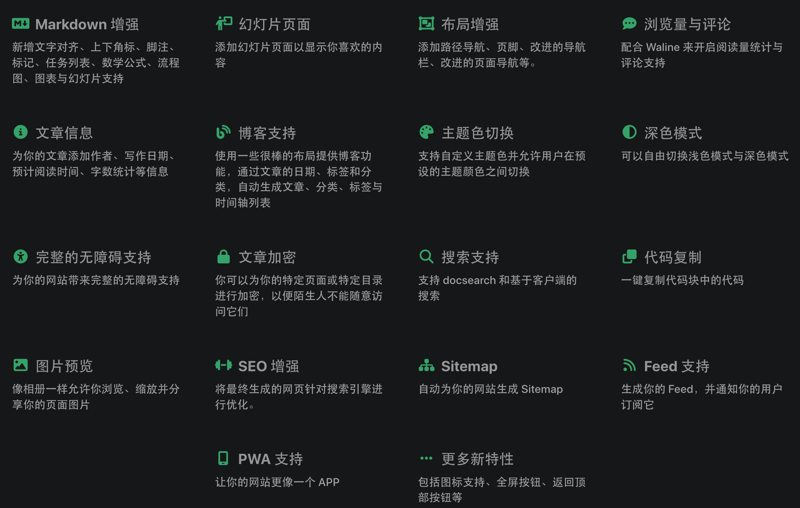
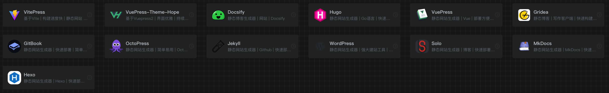

大家好，我是怪兽。

俗话说：“好记性不如烂笔头”，尤其是作为`IT`技术人员来讲，技术更新迭代的速度很快，学习技术的过程中搭建一个适合自己的个人知识库以便用来记录一些平常遇到的技术问题就显得比较重要，这样我们在后续遇到相同的问题时，可以很方便快速的查找到相关内容，今天怪兽教给大家基于[`VuePressThemeHope`](https://theme-hope.vuejs.press/zh/)主题快速搭建起一个适合自己的个人知识库。

> 个人知识库演示：https://xt-gitee.gitee.io/mynotes/

## 主题介绍

该主题不仅在[`VuePress`](https://v2.vuepress.vuejs.org/zh/)默认主题的基础上大幅提高美观性，同时搭配各种插件，在各种细节与功能上为[`VuePress`](https://v2.vuepress.vuejs.org/zh/)提供全方位的增强。使用此主题搭建知识库拥有以下几个优势：

1、可以使用`Github Pages`对个人知识库进行部署，实现公网访问。

2、添加文章方便，编译速度快。

3、部署不需要服务器，零成本。

4、搭配阿里云对象存储作为图床和`Git`工具可以很快实现备份，避免丢失数据。

当然该主题本身也支持众多特性，[`VuePressThemeHope`](https://theme-hope.vuejs.press/zh/)主题官方标记了如下特性：

鉴于搭建过程使用图文描述的形式难以讲清楚，怪兽会用分四期且使用视频的形式来讲解搭建过程，每一期的搭建具体内容如下所示：

1、删除英文及优化主页

2、优化导航栏及全站搜索功能

3、优化侧边栏及文章管理

4、优化个人导航及部署

>* `VuePressThemeHope`主题官网：https://theme-hope.vuejs.press/zh/

## 第一：删除英文及优化主页

本期内容：介绍知识库的作用并初始化创建项目，并对项目中的英文`DEMO`文章及配置内容删除，除此之外，还对知识库的主页进行配置。

>视频原地址：https://www.bilibili.com/video/BV1AW4y1p7BV/

## 第二：优化导航栏及全站搜索功能

本期内容：优化个人知识库的导航栏，同时也优化了全站搜索的功能，绑定了键盘快捷键。

>配置文件获取链接：
>
>百度云：https://pan.baidu.com/s/13VtqSUU25T7d49N1VWDbTw?pwd=cdy9 
>
>提取码：`cdy9`

>视频原地址：https://www.bilibili.com/video/BV1UY411d7id/

## 第三：优化侧边栏及文章管理

本期内容：优化个人知识库的侧边栏，然后通过几篇文章来演示知识库对文章的管理。

>视频原地址：https://www.bilibili.com/video/BV1944y1U7NP/

## 第四：优化个人导航及部署

本期内容：优化个人知识库的导航页，然后以`Gitee Pages`为例，演示静态网站的零成本部署过程。

> 视频原地址：https://www.bilibili.com/video/BV1o44y1U7qz/

>注意：
>
>1、`Gitee Pages`会审核违规违禁内容，所以有一定的概率会部署失败，需要自己定位违规违禁内容删除后，再次部署才可以。
>
>2、有能力的小伙伴可以参考我以前写的[打造个人完美导航页](https://zhuanlan.zhihu.com/p/606387934)的文章，将知识库的部署迁移到`Github Pages`上，大部分都可以部署成功。

## 开源地址

1、搭建过程用到的配置文件及相关文章：https://gitee.com/xt-gitee/mynotes

2、搭建视频合集原地址：https://space.bilibili.com/52459877/channel/collectiondetail?sid=895960

## 写在最后

像这类的静态网站生成工具有很多，比如[`VuePress`](https://v2.vuepress.vuejs.org/zh/)、[`Hexo`](https://hexo.io/zh-cn/index.html)、[`MkDocs`](https://www.mkdocs.org/)、[`Solo`](https://b3log.org/solo/)、[`Gridea`](https://open.gridea.dev/)、[`WordPress`](https://cn.wordpress.org/)、[`Jekyll`](https://jekyllcn.com/)、[`OctoPress`](http://octopress.org/docs/)、[`Hugo`](https://gohugo.io/)、[`GitBook`](https://www.gitbook.com/)、[`Docsify`](https://docsify.js.org/#/)、[`VitePress`](https://vitepress.vuejs.org/)等，重要的不是工具，重要的是自己输出和沉淀的内容，各位小伙伴一定要谨记不要纠结选择哪个工具，适合自己的就是最好的。

静态网站生成工具举例如下图，官网都可以在[怪兽导航](https://codermonster.top/)的文档相关分类中看到：

>怪兽导航：https://codermonster.top/