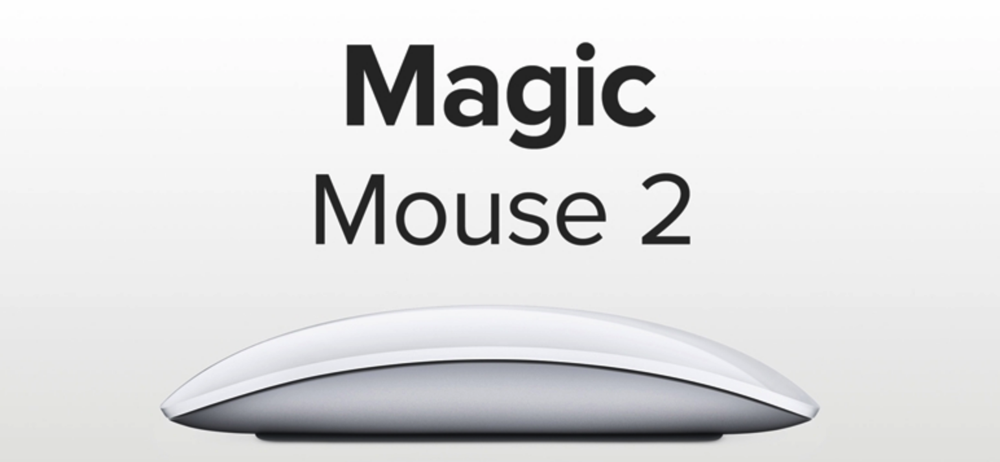
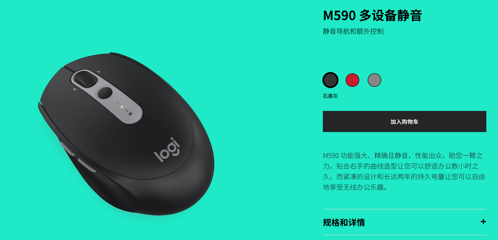
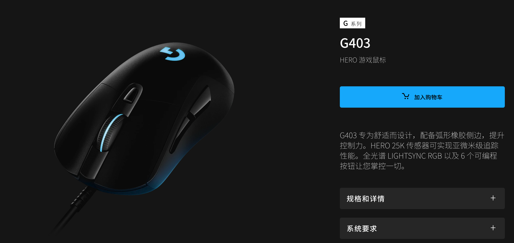
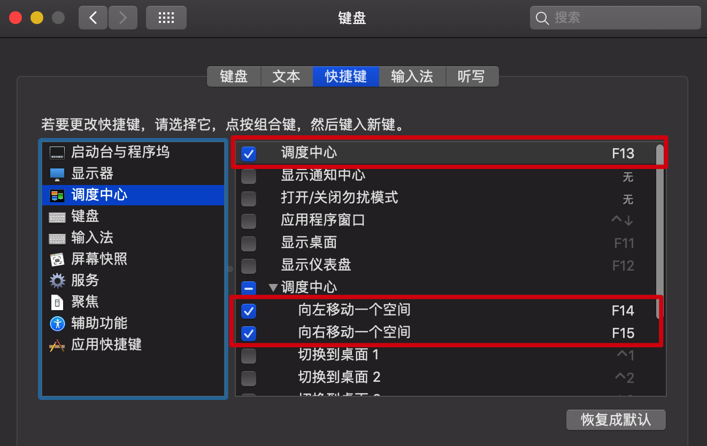
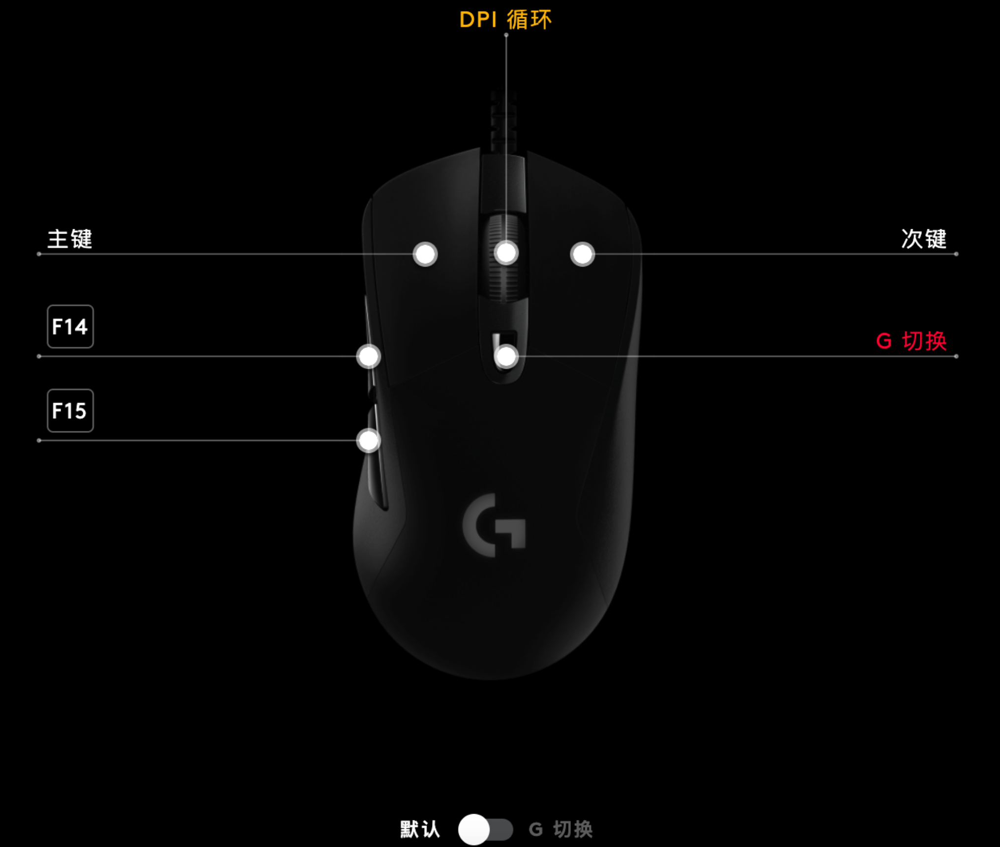
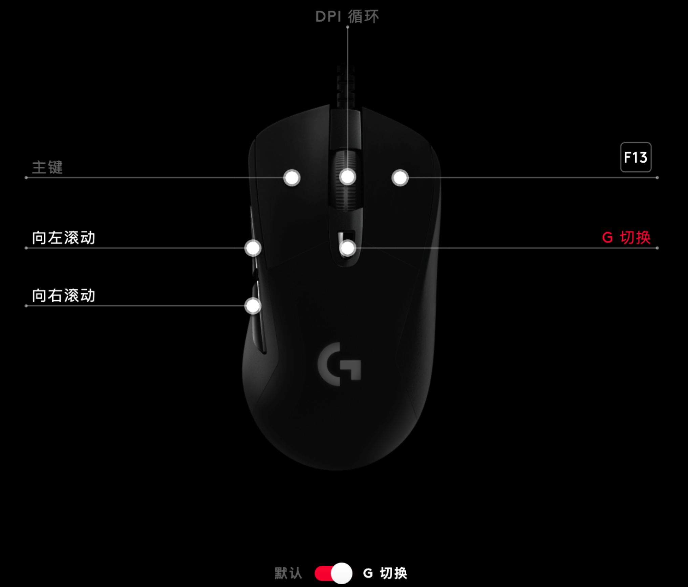

## 正文开始

本人资深`Mac`使用者，为了让`Mac`更加顺手，也尝试过很多的鼠标，包括苹果自家的`MagicMouse`、罗技办公鼠标`M590`、罗技游戏鼠标`G403Hero`，先说结论：从我个人角度来讲，罗技的游戏鼠标`G403Hero`是和`Mac`最搭的鼠标。

下面对上面每一个鼠标的优缺点详细解释一下，同时最后也会给出在`Mac`上对罗技有线游戏鼠标`G403Hero`的最佳配置方式。

### 苹果扁平MagicMouse的优缺点

我使用苹果自家的`MagicMouse`鼠标前后大约有三年的时间，实际使用过程中总结了几条优缺点，具体如下：

**优点：**

1、作为苹果自己的产品，对于`Mac`的优化比较好，使用起来很丝滑，上下滑动，左右滑动都非常方便

2、丰富的手势操作，可以大大提高效率

3、造型设计比较偏苹果一贯的简约风格

4、无线蓝牙链接，桌面不至于因为线材显得比较乱

**缺点：**

1、价格昂贵，大约三百多块钱

2、抓握使用时间长了手掌很累

3、充电一次使用时间不长，充电口在下方，所以导致充电的时候还不能使用

4、信号不稳定，电脑连接蓝牙设备多的时候容易和鼠标断联

5、左主键与右次键在点击的时候容易关联

### 罗技M590办公鼠标的优缺点

罗技作为键盘鼠标外设大厂，产品质量自然不用多说，我使用罗技的办公系列鼠标`M590`大约有一年左右，后来放弃使用的原因并不是其功能性的问题，而是其手感偏肉的问题，实际使用过程总结了几条优缺点如下：

**优点：**

1、使用无线蓝牙连接或者是优联接收器进行连接

2、价格在一百多块钱，还算便宜

3、可以通过罗技官方驱动软件`Options`自定义按键的功能

4、罗技`M590`鼠标的辅助功能按键比较多，甚至比游戏鼠标`G403Hero`还要多，除了常规的左主键和右次键、滚轮，还有左侧的两个按键，滚轮也是可以点击和左右拨动的，而且这些按键的功能都可以通过`Options`软件自定义设置

5、可以连接两个蓝牙设备，可以通过其蓝牙切换按键快速切换

6、作为一款静音鼠标，所以对于办公室人员还是比较友好的

7、通过电池供电，耗能较少，更换一次电池差不多可以使用一年左右

**缺点：**

1、手感偏肉，所以对于喜欢有反馈感的人来说手感并不是很舒服

2、鼠标比较小巧，更适合于手小的人使用

3、因为是蓝牙连接，所以电脑连接蓝牙设备多的时候会导致断连

4、鼠标指针会出现发飘的现象

### 在Mac上优化配置G403Hero游戏鼠标

通过对上面两款鼠标的优缺点进行总结，我发现我最忍受不了`Mac`上鼠标的痛点一共有以下几点：

1、充电的时候是否可以使用或者充一次电能用多长时间，即充电问题

2、信号不稳定导致的断连和发飘的问题

3、左主键与右次键容易关联的问题

4、使用时间长了容易累的问题

5、是否有反馈感，并且是否可以通过驱动软件自定义鼠标其他辅助按键的问题

偶然的一次机会接触到了罗技的有线游戏鼠标`G403Hero`，这个鼠标可以完美解决上述的所有痛点，唯一的一个缺点是该鼠标为有线鼠标，如果你想购买无线鼠标，可以尝试一下罗技的`G703`，该鼠标和`G403Hero`外观一致，采用的传感器都是最先进的`HERO25K`的游戏传感器，可以实现亚微米级别的追踪，唯一的一点不同就是可以通过无线蓝牙或者优联接收器进行连接，不过价格可能更贵一些。

因为我对鼠标断连的问题持零容忍态度，所以我没有购买`G703`，我更倾向于有线的`G403Hero`，下面以`G403Hero`有线游戏鼠标为例来教给大家如何在`Mac`上配置这款鼠标，让它成为你的神兵利器。

如果想要发挥出罗技游戏鼠标`G403Hero`的全部功能，那么必须配合其官方的`Ghub`驱动软件进行使用，在[罗技官网](https://www.logitech.com/)下载对应`Mac`系统版本的[`Ghub`](https://support.logi.com/hc/zh-cn/articles/360024361233)驱动软件进行安装，安装完成之后，我们可以在软件中注册登录自己的账号，同时修改软件的显示语言为简体中文。

接下来我们直接把鼠标通过拓展坞连接到电脑就可以了，`Ghub`驱动会自动识别鼠标型号并且进行显示，然后我们新建配置文件`xt-config`，当然这个名字可以随便取，点击激活该配置文件，对于`DPI`，也就是鼠标指针的移动速度，数值越大，指针的移动速度就越快，结合我自己的使用，这里可以设置为`1000`、`2000`、`3400`（`DPI`当前切换速度）、`7000`，默认使用`3000`的`DPI`就可以，在设置完`DPI`之后，我们就可以对辅助功能按键进行设置了。

首先在`Mac`上设置多任务`快捷键F13`、向左划屏`快捷键F14`、向右划屏`快捷键F15`，设置完成之后我们就可以将这几个快捷键绑定到鼠标的辅助按键上。下图是在`Mac`上设置快捷键示意图：

在`Mac`上设置完快捷键之后，我们打开`Ghub`软件，配置每一个辅助按键的功能，具体设置图如下：

然后我们在通过`G切换`功能实现另一套快捷键设置，点击最下方的`G切换`模式，按照下图进行设置：

>**`G切换`：**设置某一个按键为`G切换`按键，长按`G切换`可以对其他的鼠标按键设置另一套不同的按键功能，实现两套多功能按键，即用来配置鼠标组合按键的。

因为`G403Hero`鼠标还配备了`LIGHTSPEED`功能，即`RGB`灯光设置，对于灯光的显示，根据自己的喜好进行设置就可以了。

接下来我们使用罗技提供的板载内存模式将所有的配置写入鼠标，这样做的效果一是可以脱离`Ghub`驱动软件，二是将鼠标应用到其他电脑上的时候，其相关配置都存储到了鼠标中，无需下载`Ghub`软件重新设置，可以说做到了一次设置，处处使用。

>**板载内存模式：**将配置内容写入鼠标，使其脱离`Ghub`驱动软件。

打开设置，依次点击我的装备、设备、板载内存模式打开，选中刚才设置的配置文件即可，在主页面设备下方显示“板载模式”即设置成功，然后就可以删除`Ghub`驱动软件了。这个时候我们就可以直接使用鼠标了，即使把鼠标插到其他电脑上，也可以实现相同的功能。

## 实现效果

通过上面的设置，现在使用鼠标可以实现的效果如下：

1、鼠标最基本的左键单击和右键功能已经可以正常使用

2、中间的滚轮键可以正常使用，滚轮方向可能跟你日常使用不同，后续会通过其他软件优化

3、点击中间的滚轮键可以实现`DPI`的切换，即鼠标指针移动速度的切换

4、点击鼠标左边的辅助功能键，可以实现桌面的左右切换

5、按住鼠标的`G切换`按键，点击右键可以打开电脑的多任务界面

6、按住鼠标的`G切换`按键，点击鼠标左边的辅助功能键，可以实现页面的左右滑动

如果上面的设置跟你自己的使用习惯不一致，你可以重新下载`Ghub`软件进行设置，不过在重新安装`Ghub`驱动软件时，可能会遇到一直卡在初始化界面的问题，其解决方案就是删除路径`/Users/Shared/LGHUB`之后，重新在官网下载对应版本的`Ghub`进行安装。

## 两个优化

最核心的鼠标功能已经实现，下面介绍两个可以优化的内容：

**1、网页滑动卡顿并且滚轮方向相反？**

使用[`Mos`](https://mos.caldis.me/)这款开源免费的软件就可以解决上面的两个问题，软件具体配置如下：

**2、鼠标太轻导致手感不舒服？**

游戏鼠标`G403Hero`在购买的时候会赠送一枚`10克`的配重块，可以使用配重块增加鼠标的重量感。