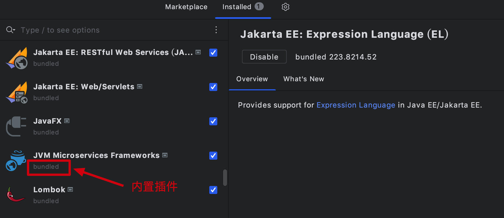
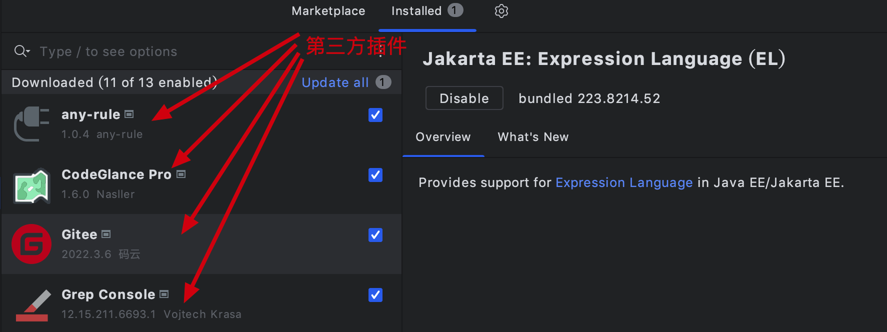

大家好，我是怪兽。

这次我们首先对IDEA插件开发有基本的认识，本节课不会涉及到任何的代码开发，文字和图片内容稍多一些，让大家首先认识一下IDEA中的插件。举个例子来说，如果你是做游戏开发的，尽管你不必精通这款游戏，但是你必须要知道游戏中用到的一些常用操作，这样当产品经理提出一个功能需求的时候，你最起码知道在哪里修改和优化代码。废话少说，接下来我们进入正题。

## IDEA插件是什么？

如果大家没有接触过IDEA插件，那么大家一定知道浏览器插件，通过浏览器插件我们可以扩展浏览器的功能，例如AdGuard浏览器插件里面拥有很多的广告过滤规则，通过安装该插件可以过滤掉很多知名网站的广告；又例如大名鼎鼎的油猴插件，该插件可以说是浏览器中的神兵利器，没有了他，就等同于没有了灵魂。

与浏览器插件类似，IDEA插件的作用就是用来扩展开发工具IDEA的功能，IDEA中的很多原生的功能都是通过插件来实现的，其插件分为内置插件和第三方插件，如下图：

内置插件：

第三方插件：

安装插件直接在IDEA开发工具的插件市场中搜索对应插件安装即可，除此之外，还可以在[官网](https://plugins.jetbrains.com/idea)下载对应的压缩包，通过本地进行安装。

>IDEA插件官网：https://plugins.jetbrains.com/idea

## 为什么要学习IDEA插件开发？

