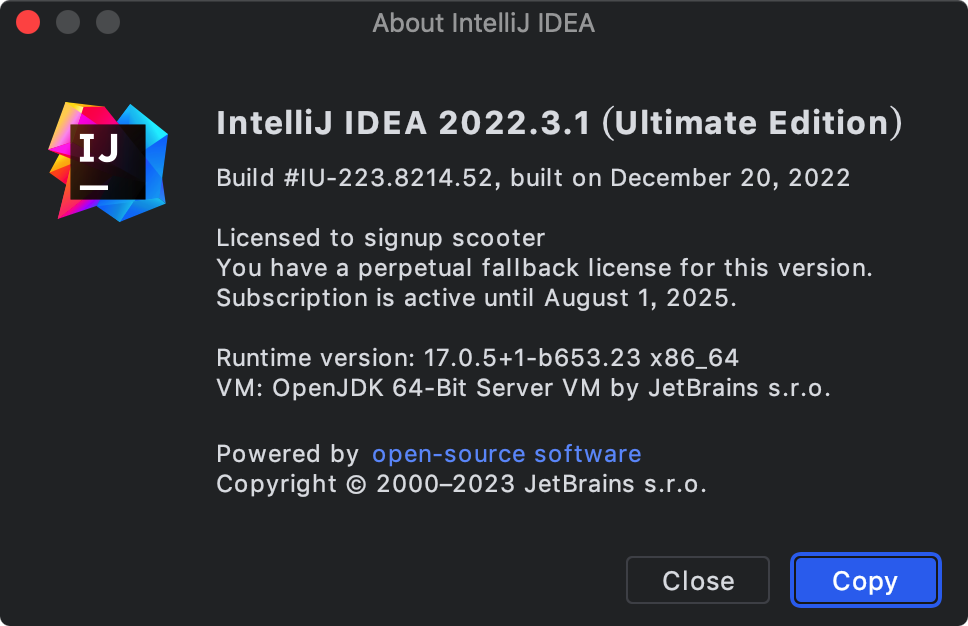
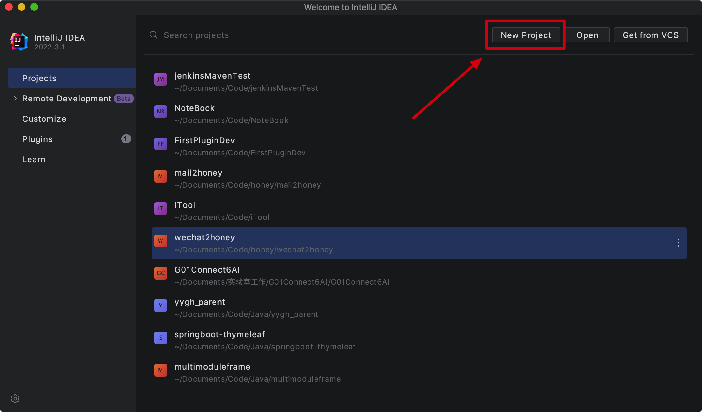
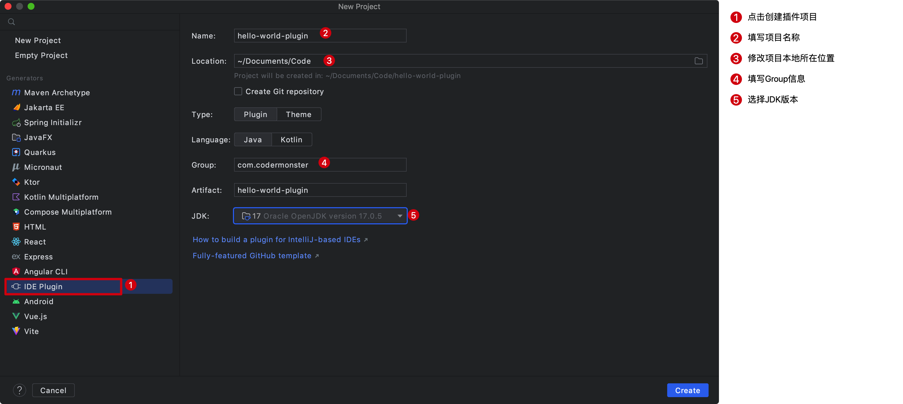

大家好，我是怪兽。

接下来我们开始程序员学技术中必不可缺的一环，即开发插件世界中的HelloWrord。开发之前，首先明确几个前提条件：

1、安装JDK8及以上版本的开发环境。

2、安装IDEA开发工具。

3、安装Gradle依赖管理和构建工具。

## 开发环境

怪兽本人的开发环境具体如下：

1、JDK版本（JDK17）

```shell
# JDK版本
java version "17.0.5" 2022-10-18 LTS
Java(TM) SE Runtime Environment (build 17.0.5+9-LTS-191)
Java HotSpot(TM) 64-Bit Server VM (build 17.0.5+9-LTS-191, mixed mode, sharing)
```

2、Gradle版本（Gradle7.6）

```shell
# Gradle版本
------------------------------------------------------------
Gradle 7.6
------------------------------------------------------------

Build time:   2022-11-25 13:35:10 UTC
Revision:     daece9dbc5b79370cc8e4fd6fe4b2cd400e150a8

Kotlin:       1.7.10
Groovy:       3.0.13
Ant:          Apache Ant(TM) version 1.10.11 compiled on July 10 2021
JVM:          17.0.5 (Oracle Corporation 17.0.5+9-LTS-191)
OS:           Mac OS X 10.14.6 x86_64
```

3、IDEA开发工具版本（2022.3专业版）



>相关命令：
>
>```shell
># 查看JDK版本信息
>java -version
># 查看Gradle版本信息
>gradle --version
>```

## 项目创建

得益于IDEA强大的功能使得我们创建一个IDEA插件项目变得非常简单，首先我们需要打开项目管理界面，新建一个项目：



点击IDE Plugin可以填写插件项目的相关信息，项目名称填写hello-world-plugin，修改项目本地所在位置，选中新建项目类型为Plugin，使用语言为Java语言，同时填写Group信息和选择JDK版本，然后点击Create进行项目的创建。




## 源码及文档下载

本教程的所有文档及源码可以关注微信公众号：码农怪兽，在公众号中回复关键字“IDEA插件开发”获取。
