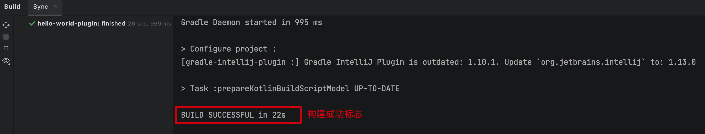
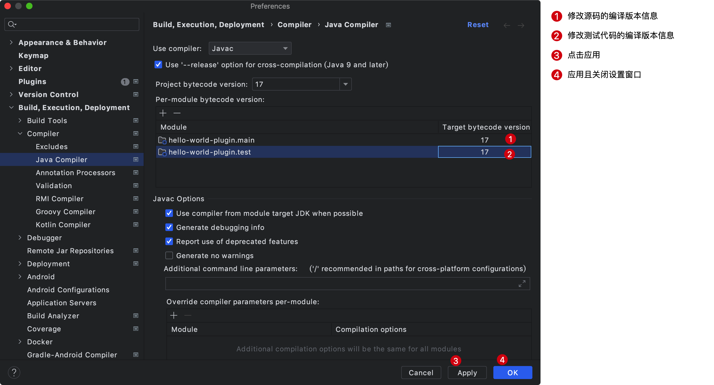
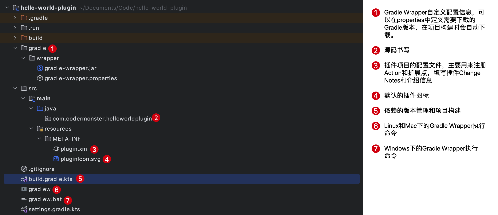

大家好，我是怪兽。

接下来我们开始程序员学技术中必不可缺的一环，即开发插件世界中的HelloWrord。开发之前，首先明确几个前提条件：

1、安装JDK8及以上版本的开发环境。

2、安装IDEA开发工具。

3、安装Gradle依赖管理和构建工具。

## 开发环境

怪兽本人的开发环境具体如下：

1、JDK版本（JDK17）

```shell
# JDK版本
java version "17.0.5" 2022-10-18 LTS
Java(TM) SE Runtime Environment (build 17.0.5+9-LTS-191)
Java HotSpot(TM) 64-Bit Server VM (build 17.0.5+9-LTS-191, mixed mode, sharing)
```

2、Gradle版本（Gradle7.6）

```shell
# Gradle版本
------------------------------------------------------------
Gradle 7.6
------------------------------------------------------------

Build time:   2022-11-25 13:35:10 UTC
Revision:     daece9dbc5b79370cc8e4fd6fe4b2cd400e150a8

Kotlin:       1.7.10
Groovy:       3.0.13
Ant:          Apache Ant(TM) version 1.10.11 compiled on July 10 2021
JVM:          17.0.5 (Oracle Corporation 17.0.5+9-LTS-191)
OS:           Mac OS X 10.14.6 x86_64
```

3、IDEA开发工具版本（2022.3专业版）


>相关命令：
>
>```shell
># 查看JDK版本信息
>java -version
># 查看Gradle版本信息
>gradle --version
>```

## 项目创建

得益于IDEA强大的功能使得我们创建一个IDEA插件项目变得非常简单，首先我们需要打开项目管理界面，新建一个项目：


点击IDE Plugin可以填写插件项目的相关信息，项目名称填写hello-world-plugin，修改项目本地所在位置，选中新建项目类型为Plugin，使用语言为Java语言，同时填写Group信息和选择JDK版本，然后点击Create进行项目的创建。


项目在创建过程中，会下载插件项目对应的依赖插件，主要包括两个：java和org.jetbrains.intellij，具体内容可以在项目路径下的build.gradle.kts文件中的plugins标签中查看。初始项目构建完成之后出现如下提示代表创建项目成功。



项目创建成功之后，我们打开IDEA应用偏好设置，修改一下项目的编译版本信息。



既然插件项目已经创建成功，那么我们接下来看一下项目的文件目录结构，了解各个目录的用处。



>Gradle Wrapper解决了什么问题？
>
>1、你本地安装的Gradle版本跟项目所需的Gradle版本不一致容易导致问题，为了解决该问题，Gradle Wrapper应运而生，Gradle Wrapper是一个脚本，可调用Gradle的声明版本，并在编译时下载。因此，开发人员可以快速启动并运行Gradle项目，而无需遵循手动安装Gradle过程。
>
>2、使用项目根目录下的gradlew命令运行的Gradle版本是Gradle Wrapper中声明的Gradle版本，不是本地安装的Gradle版本。
>
>3、gradle/wrapper/gradle-wrapper.jar是实际下载对应Gradle版本的工具包。

下面我们看一下build.gradle.kts文件的具体内容：

```kotlin
// 项目依赖插件
plugins {
    id("java")
    id("org.jetbrains.intellij") version "1.10.1"
}
// 项目Group信息
group = "com.codermonster"
// 版本信息
version = "1.0-SNAPSHOT"
// 依赖下载仓库
repositories {
    mavenCentral()
}

// Configure Gradle IntelliJ Plugin
// Read more: https://plugins.jetbrains.com/docs/intellij/tools-gradle-intellij-plugin.html
intellij {
  // 运行插件的时候，启动的IDEA版本
    version.set("2022.1.4")
    type.set("IC") // Target IDE Platform

    plugins.set(listOf(/* Plugin Dependencies */))
}

tasks {
    // Set the JVM compatibility versions
    withType<JavaCompile> {
        sourceCompatibility = "11"
        targetCompatibility = "11"
    }

    patchPluginXml {
        sinceBuild.set("221")
        untilBuild.set("231.*")
    }

    signPlugin {
        certificateChain.set(System.getenv("CERTIFICATE_CHAIN"))
        privateKey.set(System.getenv("PRIVATE_KEY"))
        password.set(System.getenv("PRIVATE_KEY_PASSWORD"))
    }

    publishPlugin {
        token.set(System.getenv("PUBLISH_TOKEN"))
    }
}

```


## 源码及文档下载

本教程的所有文档及源码可以关注微信公众号：码农怪兽，在公众号中回复关键字“IDEA插件开发”获取。
