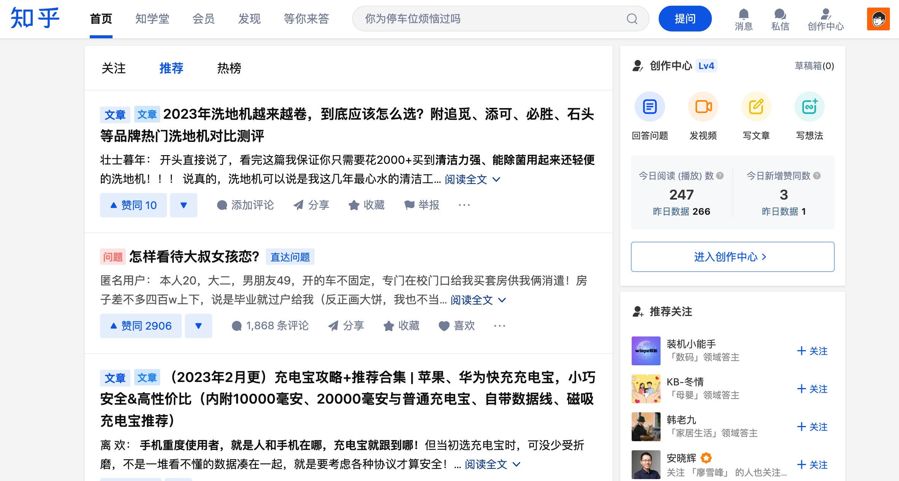
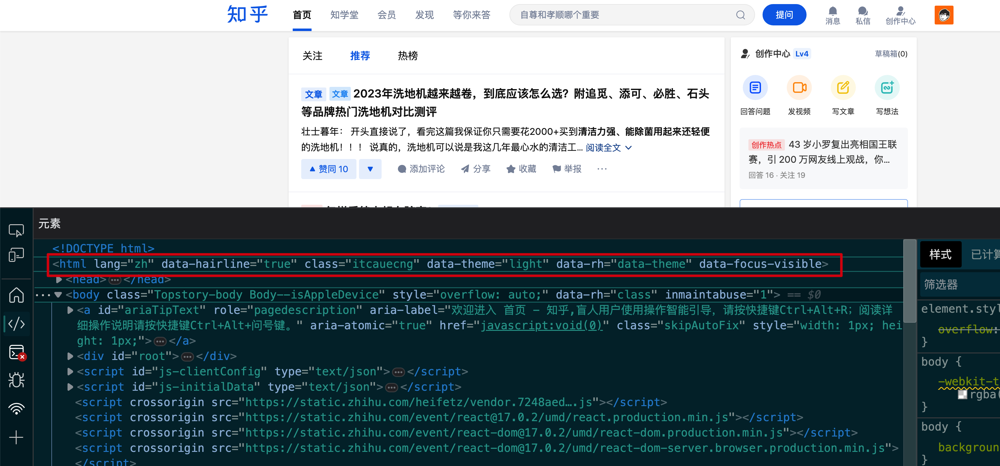
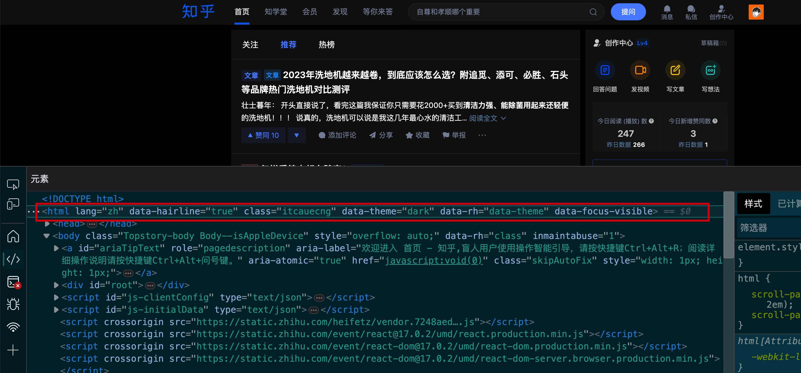
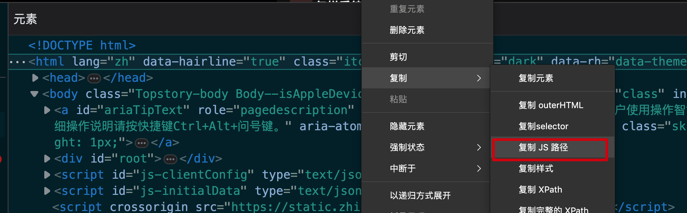
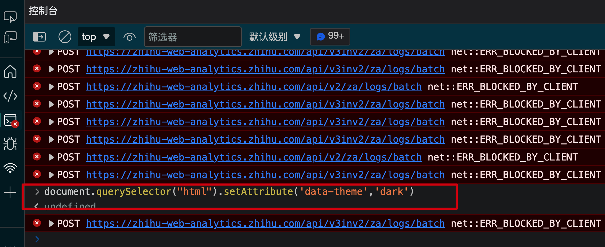
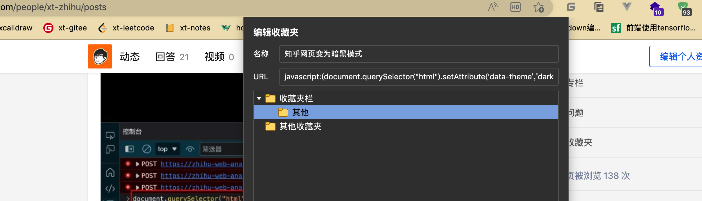
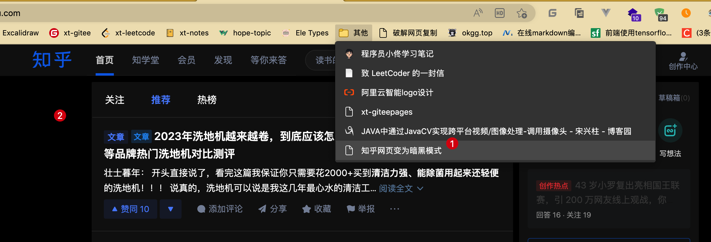
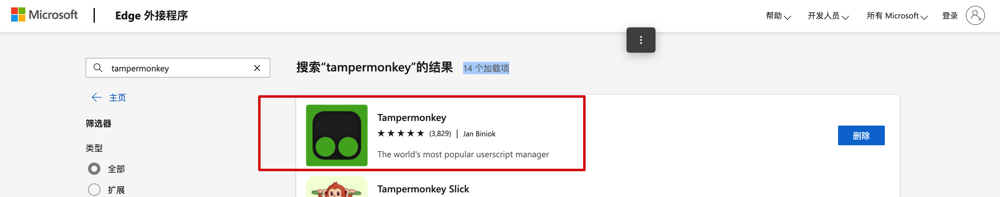
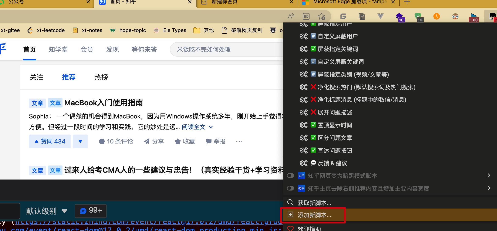
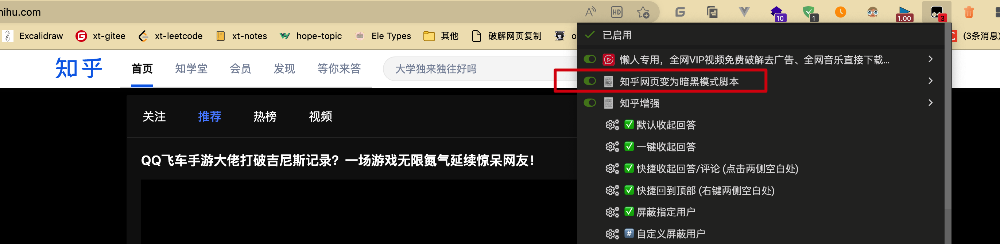

大家好，我是怪兽。

自从“优爱腾”这几个视频网站对会员的投屏和多设备登录进行限制之后，很多小伙伴就多多少少利用过油猴插件这个小东西来突破限制，产品虽小，功能不弱。作为程序员，今天来深扒一下油猴插件的原理。

## 前言

众所周知，网页就是一棵`Dom`树，而`JavaScript`可以操作`Dom`树，所以利用一些`JS`脚本可以改变网页结构，这也是油猴插件中脚本的核心原理。

## 详细谈谈JS脚本的妙用

举一个最简单的例子，利用`JS`脚本改变知乎网页端为暗黑模式，我们可以打开[知乎官网](https://www.zhihu.com/)：



通过上图可以看出知乎的网页端是日间模式，而且没有提供暗黑模式和日间模式切换的功能，接下来使用`F12`快捷键打开浏览器的开发者工具：



通过上图可以看到网页的`html`标签中有一个属性是`data-theme`，其值为`light`，其意思应该就是网页的显示为日间模式，如果改为`dark`值，知乎网页会不会变为暗黑模式呢？直接在`Dom`树中修改为`dark`试试就可以了。



通过上图可以看到知乎的网页确实已经变为暗黑模式了，事实证明修改这个值确实可以实现我们想要的功能，但是现在存在的问题是，每当我们刷新网页的时候，这个属性值就会重新被覆盖为`light`，解决办法就是写一个`JS`脚本，每次刷新网页之后，不需要通过开发者工具进行修改，直接运行这个`JS`脚本就可以。所以接下来我们写一个`JS`脚本修改这个`html`标签的`data-theme`属性值就可以了。

首先我们获取一下这个标签的`JS`路径：



然后打开控制台执行下面的代码：



```js
document.querySelector("html").setAttribute('data-theme','dark')
```

到这里脚本就写完了，如果我们想在浏览器中运行这个脚本该怎么办呢？我们可以直接将其存储在浏览器的收藏夹中，每次刷新网页之后，点击一下这个收藏地址，就会执行该脚本。



```js
javascript:(document.querySelector("html").setAttribute('data-theme','dark'))
```

此时我们打开知乎官网，看到还是日间模式，不用担心，也不用去打开开发者工具，直接点击一下刚才保存的`JS`脚本，可以看到知乎官网就变为暗黑模式了。

> 收藏夹中的脚本内容必须放在`javascript:()`中才能执行。



到这里就可以看到`JS`脚本已经基本实现了我们所需要的功能，可是每次刷新都还是日间模式，必须要点击一下该脚本才能变为暗黑模式，那么有没有一种更简单的工具，让他自动匹配知乎网页，如果匹配成功的话就自动执行脚本呢？答案是有，就是大名鼎鼎的油猴插件。

首先，我们需要先在浏览器的插件市场中下载油猴插件：



然后，在油猴插件中添加新脚本：



填写脚本内容：

```js
// ==UserScript==
// @name         知乎网页变为暗黑模式脚本
// @namespace    http://tampermonkey.net/
// @version      0.1
// @description  知乎网页变为暗黑模式脚本
// @author       码农怪兽
// @match        *://www.zhihu.com/*
// @match        *://zhuanlan.zhihu.com/*
// @icon         https://www.google.com/s2/favicons?sz=64&domain=zhihu.com
// @grant        none
// ==/UserScript==

(function() {
    'use strict';

    // Your code here...
    document.querySelector("html").setAttribute('data-theme','dark')
})();
```

这里我们需要注意`match`注解的内容，`match`注解用来匹配网站，如果是需要匹配多个网址，可以使用多个`match`注解。然后我们点击`Command+S`保存脚本就可以了。此时我们打开知乎官网，不用点击任何书签，油猴插件会自动匹配到知乎的网址，然后执行上面的`JS`脚本。



如果我们不想要自动匹配和执行该脚本，直接在油猴插件中关闭该脚本功能即可。

到现在为止，利用浏览器收藏夹和油猴插件脚本都可以实现我们想要的功能，两者的核心代码一致，基本不需要进行修改，而油猴插件相比于浏览器收藏夹更加强大，可以实现网址的自动匹配和脚本的自动执行。

## 写在最后

怪兽本人也收藏了很多工作学习中常用的`JS`脚本，有需要的小伙伴可以直接关注微信公众号：码农怪兽，在公众号中回复关键字“常用脚本”获取。